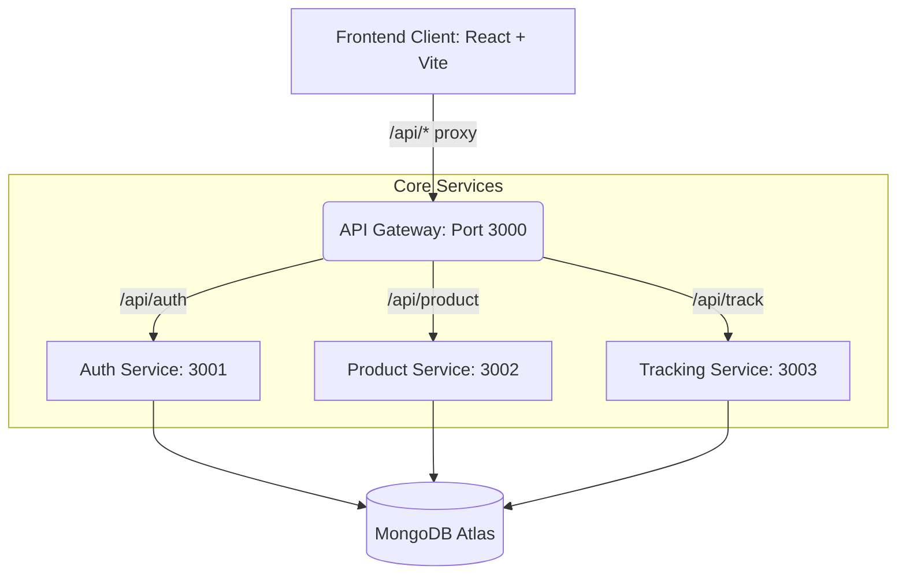

# 💊 PharmaTrace

**The Intelligent, Cryptographically-Secure Pharmaceutical Supply Chain Platform**

> 🔒 **SYSTEM STATUS:** Cryptography [**ACTIVE**]  |  Anti-Counterfeit Locks [**ENGAGED**]  |  GPS Tracking [**MANDATORY**]

PharmaTrace is a sophisticated, full-stack microservices application designed from the ground up to eradicate counterfeit drugs from the global supply chain. It provides end-to-end visibility—from the moment a batch is manufactured, through distribution logistics, down to the final retail pharmacy and end consumer.

By synthesizing **cryptographic verification**, **mandatory geolocation tracking**, and **anomaly detection heuristics**, PharmaTrace ensures that every medication reaching a patient is authentic, tracked, and safe.

---

## ✨ The Liquid Glass Experience

PharmaTrace abandons the sterile, dated aesthetics of traditional enterprise software. We've pioneered the **"Liquid Glass" Design System** to deliver a hyper-modern, immersive user experience:

*   **Dynamic Dark Mode:** Deep, rich background meshes (`#0A0E1A`) layered with subtle accent lighting.
*   **Volumetric Translucency:** Extreme frosted glass aesthetics (`backdrop-filter: blur(40px)`) that adapt to contextual layers beneath.
*   **Performant Micro-Animations:** Shimmering buttons, pulsing glows on critical alerts, and fluid route transitions using custom keyframes (`animate-float`, `animate-pulse-glow`).
*   **Information Density:** High-contrast data visualization without visual clutter, utilizing Google's `Inter` and `Plus Jakarta Sans` typography.

---

## 🛡️ Core Security Pillars

PharmaTrace was engineered with a "zero-trust" supply chain philosophy. Our multifaceted security suite includes:

### 1. Cryptographic Verification (HMAC-SHA256)
Every product is generated with a unique QR code. The payload isn't just an ID; it includes an HMAC-SHA256 digital signature verified server-side. Forged or completely fabricated QR codes immediately trigger an `INVALID_SIGNATURE` alert.

### 2. Anti-Counterfeit Lock
The physical supply chain works on a principle of custody. When a consumer scans a product, the system intrinsically **locks** it to that consumer's identity. Any subsequent scan by a different individual triggers a `POTENTIAL_COUNTERFEIT` warning, exposing duplicated QR codes.

### 3. Mandatory GPS & Geo-Cloning Detection
All operational actions—manufacturing a batch, distributor handoffs, and pharmacy receipts—**mandate** precise GPS coordinates. The system actively monitors for "Geo-Cloning" during consumer verifications; if identical codes are scanned >50km apart, the system registers a critical anomaly.

### 4. Impossible Travel Detection (Haversine Anomaly)
The tracking microservice actively calculates the Haversine distance between sequential supply chain events. If a batch "travels" at a speed exceeding commercial jet capabilities (>900 km/h), the event is flagged and quarantined in the Admin Anomaly Dashboard.

### 5. Automated Random Audits
To prevent systemic complacency, the batch generation engine enforces a probabilistic (5%) random audit selector. Flagged batches require manual administrative clearance before they can enter the consumer distribution pool.

---

## 🏗️ Microservices Architecture

Architected for resilience and scalability, the backend is split into bounded contexts, governed by a specialized API Gateway.



*   **API Gateway:** Handles unified CORS policies, aggressive rate limiting (100 req/15min), service proxying, and global request logging.
*   **Auth Service:** Manages JWT issuance, OTP-based phone verification (passwordless), and Role-Based Access Control (RBAC).
*   **Product Service:** Controls batch generation, QR HMAC signing, quantity locking, auditing logic, and recall management.
*   **Tracking Service:** Records custody handoffs, enforces mandatory geolocation, and executes Haversine impossibility checks.

---

## 🚀 Role-Based Features

| Role | Core Capabilities |
| :--- | :--- |
| **👩‍🔬 Manufacturer** | • Register single/batch products<br>• Generate signed QR codes<br>• Monitor active "Available to Ship" inventory |
| **🚚 Distributor** | • Perform mandatory GPS-tracked custody handoffs<br>• Verify active cargo transit states |
| **🏥 Pharmacy** | • Finalize supply chain closure ("Received at Pharmacy")<br>• View local product authenticity |
| **👤 Consumer** | • Public QR verification portal<br>• Full timeline history view<br>• Initiates Anti-Counterfeit Lock |
| **👑 Admin** | • Execute systemic batch recalls<br>• Resolve automated Random Audits<br>• Monitor Impossible Travel anomalies |

---

## 💻 Tech Stack

### Frontend Environment
*   **Framework:** React 19 + DOM
*   **Build Tool:** Vite 7 (High-performance HMR)
*   **Styling:** Tailwind CSS 4 (Utility-first with custom Liquid Glass primitives)
*   **Icons:** Lucide React
*   **Peripherals:** `html5-qrcode` (camera array scanning), `react-qr-code`

### Backend Environment
*   **Runtime:** Node.js (v18+)
*   **Framework:** Express.js (RESTful APIs)
*   **Database:** MongoDB Atlas (Mongoose ODM)
*   **Security:** `bcryptjs`, `jsonwebtoken` (JWT), `crypto` (HMAC), `express-rate-limit`
*   **Network:** `http-proxy-middleware`

---

## 🛠️ Project Structure

```text
PharmaTrace/
├── client/                     # React/Vite SPA
│   ├── src/
│   │   ├── components/         # Liquid Glass layout, dashboards, and primitives
│   │   ├── pages/              # Routing boundaries (Home, Profile, Verifications)
│   │   ├── App.jsx             # React Router topology
│   │   └── index.css           # Global design system tokens
│   └── package.json
│
├── services/                   # Backend Monorepo
│   ├── api-gateway/            # Unified entry point
│   ├── auth-service/           # Identity & Authentication domain
│   ├── product-service/        # Merchandise catalog & batch engine
│   └── tracking-service/       # Geographical custody ledger
│
├── start-microservices.sh      # Local dev orchestrator
├── render.yaml                 # Production IaC Blueprint
└── .env.example                # Template for required environment variables
```

---

## 🚦 API Reference Quick Look

All requests expect Bearer JWT authentication (except public endpoints).

### Auth Service (`/api/auth`)
*   `POST /register` - Provision new identity
*   `POST /send-otp` - Dispatch authentication challenge
*   `POST /login-otp` - Resolve challenge -> Receive JWT
*   `GET /admin/users` - (Admin) Fetch total system identities

### Product Service (`/api/product`)
*   `POST /batch` - (Manufacturer) Execute high-volume generation w/ quantity locks
*   `GET /:id` - (Public) Retrieve asset metadata
*   `POST /verify/:id` - (Public) Execute cryptographic & behavioral analysis of scan
*   `POST /admin/recall` - (Admin) Quell compromised batches globally

### Tracking Service (`/api/track`)
*   `POST /:id` - (Distributor/Pharmacy) Append custody event (mandates GPS)
*   `GET /:id` - (Public) Access immutable timeline ledger

---

## 🏁 Getting Started (Local Development)

### Prerequisites
*   Node.js (v18 or higher)
*   npm or yarn
*   A localized or Cloud MongoDB instance URI

### 1. Repository Setup
```bash
git clone https://github.com/your-org/PharmaTrace.git
cd PharmaTrace
```

### 2. Environment Configuration
Create a `.env` file in the root directory (matching the services' requirement):
```env
NODE_ENV=development
MONGODB_URI=mongodb+srv://<user>:<password>@cluster.mongodb.net/pharmatrace
JWT_SECRET=your_super_secret_cryptographic_key_64_chars
JWT_EXPIRY=5d
FRONTEND_URL=http://localhost:5173
GATEWAY_PORT=3000
AUTH_SERVICE_PORT=3001
PRODUCT_SERVICE_PORT=3002
TRACKING_SERVICE_PORT=3003
```

### 3. Initialize Backend Microservices
We provide an orchestration script to quickly boot the entire backend topology.
```bash
# Ensure execution permissions
chmod +x start-microservices.sh 

# Start mapping
./start-microservices.sh
```

### 4. Initialize Frontend Interface
In a new terminal instance:
```bash
cd client
npm install
npm run dev
```
Navigate your browser to `http://localhost:5173`.

---

## 🌐 Deployment Configuration

PharmaTrace relies on a decoupled deployment strategy:

### Backend Services (Render)
The repository includes a `render.yaml` Infrastructure-as-Code blueprint. Deploying to Render via Git connection will automatically provision and interlink the API Gateway, Auth, Product, and Tracking web services on independent compute nodes.

### Frontend Client (Vercel)
The `client/` directory is isolated and pre-configured for Vercel deployment. Import the repository sub-directory to Vercel, attach the production `VITE_API_URL` environment variable pointing to your deployed API Gateway, and deploy.

---

## 🤝 Contributing

We welcome contributions from the community to improve security modeling and interface design. 
1. Fork the Project
2. Create your Feature Branch (`git checkout -b feature/AmazingFeature`)
3. Commit your Changes (`git commit -m 'Add some AmazingFeature'`)
4. Push to the Branch (`git push origin feature/AmazingFeature`)
5. Open a Pull Request

---

## 📫 Contact

Raman Kumar - [@RamanKumar](https://github.com/me-raman)

Project Link: [https://github.com/me-raman/Project](https://github.com/me-raman/Project)

---

## 📜 License

Distributed under the MIT License. See `LICENSE` for more information.
