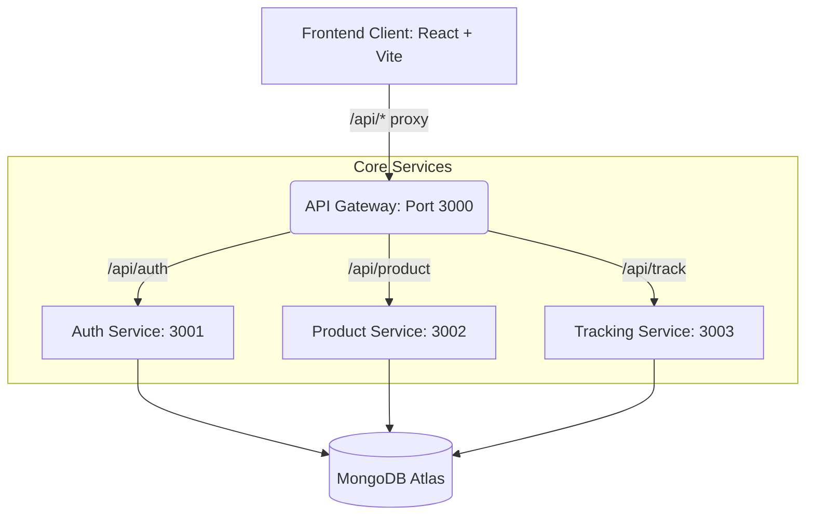

# 💊 PharmaTrace

**The Intelligent, Cryptographically-Secure Pharmaceutical Supply Chain Platform**

> 🔒 **SYSTEM STATUS:** Cryptography [**ACTIVE**]  |  Anti-Counterfeit Locks [**ENGAGED**]  |  GPS Tracking [**MANDATORY**]

PharmaTrace is a full-stack microservices application designed to eradicate counterfeit drugs from the global supply chain. It provides end-to-end visibility—from the moment a batch is manufactured, through multi-hop distribution logistics, down to the final retail pharmacy and end consumer verification.

By synthesizing **cryptographic QR verification**, **mandatory geolocation tracking**, **batch-level dual-confirmation handoffs**, and **anomaly detection heuristics**, PharmaTrace ensures that every medication reaching a patient is authentic, tracked, and safe.

---

## ✨ The Liquid Glass Experience

PharmaTrace pioneers the **"Liquid Glass" Design System** delivering a hyper-modern, immersive user experience:

*   **Dynamic Dark Mode:** Deep background meshes (`#0A0E1A`) with contextual accent lighting
*   **Volumetric Translucency:** Frosted glass aesthetics (`backdrop-filter: blur(40px)`) adapting to layers beneath
*   **Performant Micro-Animations:** Shimmering buttons, pulsing glows on alerts, fluid transitions (`animate-float`, `animate-pulse-glow`)
*   **Premium Typography:** Google's `Inter` and `Plus Jakarta Sans` for high-contrast, scannable data

---

## 🛡️ Core Security Pillars

### 1. Cryptographic QR Verification (HMAC-SHA256)
Every product gets a unique QR code containing an HMAC-SHA256 digital signature. The QR embeds a full verification URL — when scanned with any phone camera, it opens the product authenticity page directly. Forged codes trigger an `INVALID_SIGNATURE` alert.

### 2. Scan-Before-Confirm Handoff Protocol
Distributors and pharmacies **cannot** confirm receipt of a shipment without first scanning the batch QR code. This prevents blind confirmations and ensures physical possession before acknowledging receipt.

### 3. Anti-Counterfeit Lock
When a consumer scans a product, the system **locks** it to that consumer's identity. Subsequent scans by different individuals trigger a `POTENTIAL_COUNTERFEIT` warning, exposing duplicated QR codes.

### 4. Mandatory GPS & Geo-Cloning Detection
All operational actions — manufacturing, shipping, handoff confirmations — **mandate** precise GPS coordinates via the `useStrictLocation` hook and `requireCoords` middleware. Consumer scans >50km apart trigger `GEO_CLONE_DETECTED` anomalies.

### 5. Impossible Travel Detection (Haversine)
The tracking service calculates Haversine distance between sequential supply chain events. Batches "traveling" faster than commercial jets (>900 km/h) are flagged in the Admin Anomaly Dashboard.

### 6. Batch Quantity Locking
Once a batch is generated, its unit count is **permanently locked**. Any attempt to add units to an existing batch is blocked and audit-logged.

### 7. Automated Random Audits
5% of all batches are probabilistically flagged for manual admin review. Flagged batches cannot be verified by consumers until cleared.

---

## 🔄 Supply Chain Workflow

```
┌──────────────┐     Ship Batch     ┌──────────────┐     Ship Batch     ┌──────────────┐
│ Manufacturer │ ──────────────────▶ │ Distributor  │ ──────────────────▶ │   Pharmacy   │
│              │                     │              │                     │              │
│ • Generate   │                     │ • Scan QR    │                     │ • Scan QR    │
│   batch QR   │                     │ • Confirm ✓  │                     │ • Confirm ✓  │
│ • Ship batch │                     │ • Or Dispute │                     │ • Dispense   │
└──────────────┘                     │ • Forward    │                     └──────┬───────┘
                                     │   ship       │                            │
                                     └──────────────┘                            ▼
                                                                          ┌──────────────┐
                                                                          │   Customer   │
                                                                          │              │
                                                                          │ • Scan QR    │
                                                                          │ • Verify     │
                                                                          │ • Download   │
                                                                          │   certificate│
                                                                          └──────────────┘
```

### Dual-Confirmation Handoff Protocol
Every batch transfer requires **two steps**:
1. **Sender** initiates shipment (status: `SHIPPED`)
2. **Receiver** scans QR code → then confirms receipt (status: `CONFIRMED`)

If receiver disputes, status becomes `DISPUTED`. Unconfirmed shipments auto-expire after **72 hours**.

### Forward Shipping
Distributors can forward-ship received batches to other distributors or pharmacies, enabling multi-hop supply chains. Self-shipment is blocked.

### Customer Verification
QR codes embed a full URL (`https://domain.com/verify/PRODUCT-ID.SIGNATURE`). When scanned with any phone camera:
- Opens the verification page directly (no app download, no login required)
- Shows product authenticity, full supply chain timeline, and downloadable certificate
- Triggers anti-counterfeit lock + geo-anomaly checks

---

## 🏗️ Microservices Architecture



*   **API Gateway** — CORS policies, rate limiting (100 req/15min), service proxying, request logging
*   **Auth Service** — JWT authentication, role-based access (RBAC), licence verification, password reset, reputation scoring
*   **Product Service** — Batch generation, QR HMAC signing, quantity locking, recall management, anomaly detection
*   **Tracking Service** — Batch-level handoffs, GPS-enforced custody transfers, inventory management, activity history

---

## 🚀 Role-Based Portals

| Role | Core Capabilities |
| :--- | :--- |
| **👩‍🔬 Manufacturer** | • Register batches with quantity lock<br>• Generate signed QR codes (URL-embedded)<br>• Ship batches to distributors/pharmacies<br>• Monitor recent batches & inventory |
| **🚚 Distributor** | • Scan QR to verify incoming shipments<br>• Confirm or dispute batch receipts<br>• Forward-ship to other distributors or pharmacies<br>• View inventory & batch-level activity history |
| **🏥 Pharmacy** | • Scan QR to verify incoming shipments<br>• Confirm or dispute batch receipts<br>• Update tracking status (Received / Dispensed)<br>• Verify individual products by ID |
| **👤 Customer** | • Scan QR on medication packaging<br>• View product authenticity & supply chain timeline<br>• Download printable authenticity certificate<br>• Share verification report |
| **👑 Admin** | • Execute batch recalls<br>• Resolve random audit flags<br>• Monitor anomalies (duplicate scans, impossible travel, expired in transit)<br>• Manage users, licences & reputation scores |

---

## 💻 Tech Stack

### Frontend
*   **Framework:** React 19
*   **Build Tool:** Vite 7 (HMR)
*   **Styling:** Tailwind CSS 4 (with custom Liquid Glass design system)
*   **Icons:** Lucide React
*   **QR:** `html5-qrcode` (camera scanning), `react-qr-code` (QR generation)

### Backend
*   **Runtime:** Node.js (v18+)
*   **Framework:** Express.js
*   **Database:** MongoDB Atlas (Mongoose ODM)
*   **Security:** `bcryptjs`, `jsonwebtoken`, `crypto` (HMAC-SHA256), `express-rate-limit`
*   **Network:** `http-proxy-middleware`

---

## 🛠️ Project Structure

```text
PharmaTrace/
├── client/                          # React/Vite SPA
│   ├── src/
│   │   ├── components/
│   │   │   ├── AdminDashboard.jsx       # Admin portal (recalls, audits, anomalies)
│   │   │   ├── ManufacturerDashboard.jsx # Batch generation & QR codes
│   │   │   ├── DistributorDashboard.jsx  # Handoffs, inventory, forward shipping
│   │   │   ├── PharmacyDashboard.jsx     # Receipt confirmation, dispensing
│   │   │   ├── Scanner.jsx               # html5-qrcode camera scanner
│   │   │   ├── Layout.jsx                # Navbar & Footer
│   │   │   ├── Login.jsx / SignUp.jsx    # Authentication
│   │   │   ├── layout/                   # DashboardShell, LocationPermissionModal
│   │   │   └── ui/                       # Button, Card, Badge, Input, Select, etc.
│   │   ├── pages/
│   │   │   ├── Home.jsx                  # Public landing + role-based routing
│   │   │   ├── ProductDetails.jsx        # Verification result (timeline + certificate)
│   │   │   ├── Profile.jsx               # User profile management
│   │   │   └── ChangePassword.jsx        # Password update
│   │   ├── App.jsx                       # View routing (/verify/:id, /profile, etc.)
│   │   └── index.css                     # Liquid Glass design system tokens
│   └── package.json
│
├── services/                         # Backend Microservices
│   ├── api-gateway/                  # Unified entry point (port 3000)
│   ├── auth-service/                 # Identity & RBAC (port 3001)
│   │   └── routes/
│   │       ├── auth.js               # Register, login, password reset
│   │       ├── admin.js              # User management, licence verification
│   │       └── reputation.js         # Reputation scoring system
│   ├── product-service/              # Batch engine (port 3002)
│   │   └── routes/
│   │       └── product.js            # CRUD, batch gen, verify, recall, anomalies
│   └── tracking-service/             # Custody ledger (port 3003)
│       └── routes/
│           ├── handoff.js            # Ship/confirm/dispute batch, inventory, activity
│           ├── track.js              # Per-product tracking events
│           └── reconciliation.js     # Batch reconciliation checks
│
├── start-microservices.sh            # Local dev orchestrator
├── render.yaml                       # Production IaC blueprint (Render)
└── .env                              # Environment variables
```

---

## 🚦 API Reference

All requests require Bearer JWT authentication unless marked **(Public)**.

### Auth Service (`/api/auth`)

| Method | Endpoint | Access | Description |
| :--- | :--- | :--- | :--- |
| `POST` | `/register` | Public | Register new user (with GPS for supply chain roles) |
| `POST` | `/login` | Public | Email/password authentication → JWT |
| `GET` | `/verify` | Auth | Verify JWT token validity |
| `POST` | `/update-password` | Auth | Change password |
| `POST` | `/forgot-password` | Public | Send password reset email |
| `POST` | `/reset-password` | Public | Reset password with token |
| `GET` | `/users-by-role/:role` | Auth | List users by role |
| `GET` | `/admin/users` | Admin | List all system users |
| `GET` | `/admin/stats` | Admin | Platform-wide statistics |
| `PUT` | `/admin/users/:id` | Admin | Update user profile |
| `DELETE` | `/admin/users/:id` | Admin | Remove user |
| `PATCH` | `/admin/users/:id/verify` | Admin | Approve/reject licence |
| `GET` | `/admin/reputation` | Admin | All user reputation scores |
| `POST` | `/admin/reputation/recalculate` | Admin | Recalculate all scores |
| `POST` | `/admin/reputation/adjust` | Admin | Manual score adjustment |

### Product Service (`/api/product`)

| Method | Endpoint | Access | Description |
| :--- | :--- | :--- | :--- |
| `POST` | `/` | Manufacturer | Create single product |
| `POST` | `/batch` | Manufacturer | Generate batch with quantity lock |
| `GET` | `/:id` | **Public** | Get product details + history |
| `POST` | `/verify/:id` | **Public** | Full verification (signature + lock + geo + audit) |
| `GET` | `/batch/:batchNumber` | Auth | Get all products in a batch |
| `GET` | `/manufacturer/recent` | Manufacturer | Recent batches (grouped) |
| `GET` | `/admin/batches` | Admin | All batches system-wide |
| `GET` | `/admin/batch/:batchNumber` | Admin | Batch detail view |
| `GET` | `/admin/stats` | Admin | Product statistics |
| `GET` | `/admin/anomalies` | Admin | Anomaly detection report |
| `POST` | `/admin/recall` | Admin | Recall entire batch |

### Tracking Service (`/api/track`)

| Method | Endpoint | Access | Description |
| :--- | :--- | :--- | :--- |
| `POST` | `/ship-batch` | Manufacturer/Distributor | Ship batch (creates handoff) |
| `POST` | `/confirm-batch/:batchNumber` | Auth | Confirm batch receipt (GPS required) |
| `POST` | `/dispute-batch/:batchNumber` | Auth | Dispute batch receipt |
| `GET` | `/pending` | Auth | Incoming shipments for current user |
| `GET` | `/my-inventory` | Auth | Current held inventory |
| `GET` | `/my-activity` | Auth | Batch-level activity history |
| `POST` | `/:id` | Auth | Add tracking event (GPS required) |
| `GET` | `/:id` | **Public** | Product tracking timeline |
| `GET` | `/user/history` | Auth | User's tracking history |
| `GET` | `/user/stats` | Auth | User's tracking statistics |
| `GET` | `/handoff-history/:productId` | Auth | Full handoff chain for a product |

---

## 🏁 Getting Started

### Prerequisites
*   Node.js v18 or higher
*   npm
*   MongoDB Atlas cluster (or local MongoDB instance)

### 1. Clone Repository
```bash
git clone https://github.com/me-raman/Project.git
cd Project
```

### 2. Environment Configuration
Create a `.env` file in the project root:
```env
NODE_ENV=development
MONGODB_URI=mongodb+srv://<user>:<password>@cluster.mongodb.net/pharmatrace
JWT_SECRET=your_super_secret_cryptographic_key_64_chars
JWT_EXPIRY=5d
FRONTEND_URL=http://localhost:5173
QR_SECRET=your_qr_hmac_secret_key
GATEWAY_PORT=3000
AUTH_SERVICE_PORT=3001
PRODUCT_SERVICE_PORT=3002
TRACKING_SERVICE_PORT=3003
```

### 3. Install Dependencies
```bash
# Install dependencies for all services
cd services/api-gateway && npm install && cd ../..
cd services/auth-service && npm install && cd ../..
cd services/product-service && npm install && cd ../..
cd services/tracking-service && npm install && cd ../..
cd client && npm install && cd ..
```

### 4. Start Backend
```bash
chmod +x start-microservices.sh
./start-microservices.sh
```

### 5. Start Frontend
In a new terminal:
```bash
cd client
npm run dev
```

Navigate to **http://localhost:5173**

### 6. Database Reset (for fresh testing)
To clear all products, handoffs, and trackings while keeping user accounts:
```bash
cd services/tracking-service && node -e "
const mongoose = require('mongoose');
require('dotenv').config({ path: '../../.env' });
mongoose.connect(process.env.MONGODB_URI).then(async () => {
  const db = mongoose.connection.db;
  await db.collection('products').deleteMany({});
  await db.collection('handoffs').deleteMany({});
  await db.collection('trackings').deleteMany({});
  console.log('Cleared products, handoffs, trackings. Users kept.');
  process.exit(0);
});
"
```

---

## 🌐 Deployment

### Backend (Render)
The repository includes a `render.yaml` IaC blueprint. Connect via Git to auto-provision the API Gateway, Auth, Product, and Tracking services on independent nodes.

### Frontend (Vercel)
Import the `client/` directory to Vercel. Set `VITE_API_URL` to your deployed API Gateway URL.

---

## 🤝 Contributing

1. Fork the Project
2. Create your Feature Branch (`git checkout -b feature/AmazingFeature`)
3. Commit your Changes (`git commit -m 'Add some AmazingFeature'`)
4. Push to the Branch (`git push origin feature/AmazingFeature`)
5. Open a Pull Request

---

## 📫 Contact

Raman Kumar - [@RamanKumar](https://github.com/me-raman)

Project Link: [https://github.com/me-raman/Project](https://github.com/me-raman/Project)

---

## 📜 License

Distributed under the MIT License. See `LICENSE` for more information.
